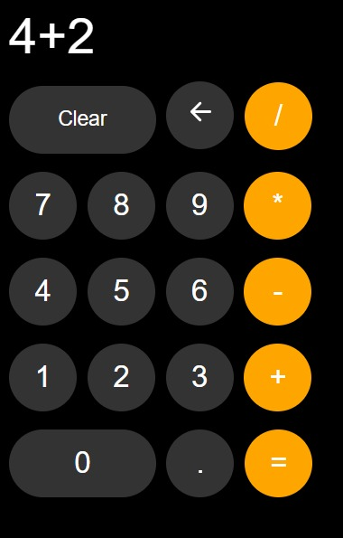

# Calculator

The project of a simple calculator

## Screenshots

### Try [Here!](https://mrmax01.github.io/calculator/) 
## Description

Takes both button clicks and keyboard numbers as input.

- With 'Spacebar' you delete the operation on the display

- With 'Backspace' you delete the last item added
- With 'Enter' do the equal.
If by chance you close the page or refresh it.... don't worry the display is saved in the localStorage.
## 🛠 Skills
Javascript, HTML, CSS

## Authors

- [@Massimo](https://www.github.com/MrMax01)

